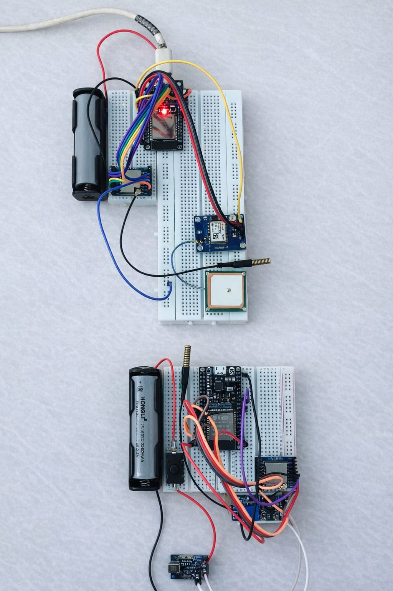

<p align="center">
  
</p>

<h1 align="center">🛡️ IoT-Based Soldier Detection & Tracking System</h1>

<h3 align="center">
Project Name: <b>PathGuard</b>
</h3>

<p align="center">


</p>

<p align="center">


</p>

---

# 📖 Overview

The **IoT-Based Soldier Detection & Tracking System (PathGuard)** is an intelligent defense monitoring solution designed to improve battlefield awareness through **real-time soldier tracking**.

The project combines **ESP32**, **GPS**, **LoRa Communication**, **React**, and **Node.js** to provide accurate soldier locations on an interactive dashboard, helping command centers monitor personnel and respond quickly during critical missions.

---

## 🚀 Project Status

🟢 **Active Development**

**Current Version:** v1.0

**Development Stage:** Prototype

---

## ⭐ Repository Statistics

<p align="center">


</p>

---

# ✨ Features

- 📍 Real-time GPS Location Tracking
- 📡 Long-range LoRa Communication
- 🛰 ESP32-based Embedded System
- 🗺 Interactive React Dashboard
- 🔗 REST API using Node.js & Express
- 🔒 CyberWall Security Monitoring
- ⚡ Live Communication between Hardware and Dashboard
- 📊 Modular Project Architecture

---

# 🛠 Technologies Used

## 🎨 Frontend

- React
- Vite
- JavaScript
- HTML
- CSS

---

## ⚙ Backend

- Node.js
- Express.js
- REST APIs

---

## 📡 Hardware

- ESP32
- GPS Module
- LoRa Module

---

## 🛠 Tools

- Git
- GitHub
- VS Code
- Arduino IDE

---

# 🖼 Hardware Connection

<p align="center">



</p>

---

# 🏗 System Architecture

🚧 **Architecture Diagram Coming Soon**

The architecture includes:

- ESP32
- GPS Module
- LoRa Communication
- Node.js Backend
- React Dashboard
- Command Center

---

# 📂 Project Structure

```text
PathGuard/
│
├── frontend/
├── backend/
├── gps-tracker/
├── arduino_sketches/
│
├── assets/
│   ├── hardware-connection.jpeg
│   └── pathguard-banner.png
│
├── .gitignore
└── README.md
```

---

# ⚙ Installation

## 1️⃣ Frontend

```bash
cd frontend
npm install
npm run dev
```

---

## 2️⃣ Backend

```bash
cd backend
npm install
npm start
```

---

## 3️⃣ GPS Tracker

```bash
cd gps-tracker
npm install
node server.js
```

---

## 4️⃣ Arduino

1. Open Arduino IDE.
2. Open the sketch inside `arduino_sketches`.
3. Select ESP32 Board.
4. Select the COM Port.
5. Upload the sketch.

---

# 🔒 CyberWall Module

The CyberWall module enhances system security by:

- Monitoring incoming network traffic
- Detecting suspicious activity
- Identifying anomalies
- Sending alerts to the dashboard

Testing can be performed using **Postman** or simulated JSON requests.

---

# 📸 Screenshots

## 🖥 Dashboard

🚧 Under Development

---

## 🗺 Live Map

🚧 Under Development

---

# 🌐 Live Demo

🚧 Coming Soon...

The application will be deployed after development is complete.

---

# 🚀 Future Improvements

- 🤖 AI-powered Threat Detection
- 📱 Android Application
- ☁ Cloud Deployment
- 📊 Analytics Dashboard
- 📍 Geofencing
- 🔔 Push Notifications
- 🌍 Multi-Soldier Tracking
- 📡 MQTT Communication
- 🔋 Battery Monitoring
- 📈 Real-time Performance Analytics

---

# 👨‍💻 Team

## Project Name

**PathGuard**

Developed as an IoT-based defense tracking solution for real-time soldier monitoring.

---

# 📜 License

This project is developed for educational and research purposes.

---

# ⭐ Support

If you found this project helpful, please consider giving it a ⭐ on GitHub.

---

<p align="center">

<b>"Not all heroes wear capes. Some wear uniforms."</b>

<br><br>

Made with ❤️ by <b>Aruna Kumar Gouda</b>

</p>
